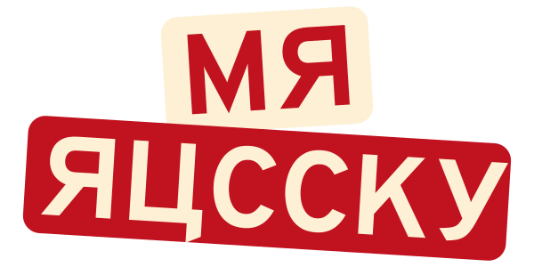

<!-- English Version -->

<!-- Main Logo -->
<div align="center">
	<br>
	
</div>
<!-- Version Badge -->
<div align="center">
	<br>
	
</div>
<!-- MD File Languages -->
<div align="center">
    <a href="#english">
        
    </a>
    &nbsp;
    <a href="#español">
        
    </a>
</div>

<br>

# English
# :ru: Mr Russky - A Russian Vocab App

A 100% Frontend web application for learning basic Russian vocabulary through images and interactive exercises. Designed especifically for beginners, it includes categories such as: nouns, verbs and adjetives.

<br>

## :question: About the Project:

The main reason behind this project steams from a personal observation: unlike English, the Russian language lacks sufficient accessible, structured, and adapted learning materials —especially for Spanish-speaking learners. English has been globally adpoted in many ways, and learning resources for it have grown exponentially. In contrast, other languages like Russian often face significant difficulties when it comes to developing and distributing quality educational content.

As a Spanish speaker trying to learn Russian, I personally struggled to find resources tailored to my native language and learning style. That experience inspired me to create **Mr. Russky** —a simple and effective way to focus on what many consider the most essential part of any language: its vocabulary.

While Russian grammar is known for its complex system of cases, this application puts vocabulary first to help beginners build confidence. The goal is to enable learners to see real progress early on, before being overwhelmed or discouraged by grammatical structures —a common reason why many give up learning the language.

This project is my way of showing appreciation for the Russian language and contributing to its learning in a friendly, accesible way from a Spanish-speaking perspective.

<br>

## :star2: Characteristics:

- Vocabulary organized by parts of speech (nouns, verbs, adjectives).
- Translations in Spanish and English
- Images associated with each word to facilitate visual learning.
- Interactive practice sessions with automatic correction.
- Progress saved in cookies and localstorage.
- Multilingual support for the interface (Spanish and English)
- Open Source with no Backend, hosted directly on GitHub Pages.

<br>

## :gear: Tools Used:

(Still under discussion)

| Herramienta | Descripción |
| :---------: | :---------- |
| React.js 		    | Main Framework for user interface development. |
| Typescript 	    | Main languague for improved project scalability, error prevention, and easier collaboration. |
| Vite 			    | The easiest tool to use for building your project. |
| Tailwind.css 	    | To manage unified CSS styles across your project. |
| MUI Components    | To use the most common components in your project and reduce development time. |
| Shields.io 	    | To include badges in your README.md and other .md files. |
| Wikipedia Commons | For images presented during the app's lessons. |
| OpenMoji 		    | For more specific vocabulary images. |
| JSON Files 	    | To serve as a "database" for our available vocabulary. |
| Jest 		        | To perform unit and integration testing of React components and other elements of the app. |
| GitHub Pages 	    | For rapid and free deployment of our app. |

<br>

## :computer: Online Demo:
👉 [Try The Web App Now!](https://umbrisseal.github.io/Mr-Russky/) -->
<!-- Screenshots de la aplicacion -->
<!-- Seccion: Estructura del proyecto (futuro) -->
<!-- <br> -->

## :bulb: How to Contribute:

This is an open source educational project. Contributions of any kind are welcome!

### :bulb: You Can Help By:
- Correcting errors in the vocabulary.
- Adding new words to existing categories.
- Proposing new categories.
- Improving the design or user expirience.
- Translating the user interface or content.
- Reporting bugs or suggestions in the "Issues" section of GitHub.

### :wrench: How to Get Started:

1. Fork this repository.
2. Clone your Fork to your local machine:
	```bash
	git clone https://github.com/umbrisSeal/Mr-Russky.git
	cd mr-russky
	```
3. Install the necessary depenencies:
	```bash
	npm install
	```
4. Start the development enviroment:
	```bash
	npm run dev
	```
5. Make your changes and submit a Pull Request.

<br>

## 🇲🇽 :ru: About the Project Name:

The name **"Mr. Russky"** was chosen as a friendly and catchy title for this educational app focused on learning Russian vocabulary. We understand that the word _"Russky"_ (русский) simply means **"Russian"** in its adjective form, but we also acknowledge that, in certain historical contexts —particularly in the United States during the Cold War— this term was used with negative connotations.

:point_right: **We want to make it clear that this is not the case here.**  

This project was created and is led by a **Mexican** developer, with the sole purpose of offering a free, open, and respectful tool for learning the Russian language.

The use of the Cyrillic alphabet in the logo is also **purely stylistic**. We know some letters are used outside their proper grammatical context, but this was intentional to create a fun visual design and **is not meant to be mocking or offensive** towards the Russian language or culture.

I deeply appreciate and respect the Russian language and people. If at any point any part of the project is found inappropriate or misunderstood, I am fully open to receiving feedback and making necessary adjustments.

:love_letter: :speech_balloon: _Thank you for your understanding and for being part of this learning community!_

<br>

## 🙌 Credits:

- Images legally extracted from [Wikimedia Commons](https://commons.wikimedia.org) and [OpenMoji](https://openmoji.org).
- Inspired by the idea of facilitating language learning with images and active practice.

<br>
<br>


---
---
---


<!-- Spanish Version -->


<!-- Main Logo -->
<div align="center">
	<br>
	
</div>
<!-- Version Badge -->
<div align="center">
	<br>
	
</div>
<!-- MD File Languages -->
<div align="center">
    <a href="#english">
        
    </a>
    &nbsp;
    <a href="#español">
        
    </a>
</div>

<br>

# Español
# :ru: Mr Russky - Una Aplicación de Vocabulario Ruso

Una aplicación web 100% Frontend para aprender vocabulario básico del idioma ruso a través de imágenes y ejercicios interactivos. Diseñada especialmente para principiantes con categorías como sustantivos, verbos y adjetivos.

<br>

## :question: Acerca del Proyecto:

El propósito principal de este proyecto nace de una observación personal: a diferencia del inglés, el idioma ruso no cuenta con suficiente material accesible, estructurado y adaptado para estudiantes hispanohablantes. Mientras que el inglés ha sido adoptado globalmente y goza de una abundancia de recursos de aprendizaje, muchos otros idiomas —como el ruso— enfrentan una notable falta de contenidos educativos modernos, especialmente pensados desde otras lenguas que no sean el inglés.

Durante mi propio proceso de aprendizaje, me encontré con una carencia de recursos que se ajustaran a mis métodos de estudio y a mi lengua materna. Fue entonces cuando decidí crear **Mr. Russky**, una herammienta sencilla y efectiva para enfocarse en lo que muchos consideran el corazón del idioma: su vocabulario.

Aunque el ruso es conocido por sus complejos casos gramaticales, la aplicación prioriza el aprendizaje de nuevas palabras como punto de entrada accesible. Esta estrategia busca brindar confianza al estudiante principiante y permite ver avances concretos antes de enfrentarse al desafío de la gramática más avanzada —una etapa que suele desmotivar a muchos y hacer que abandonen el idioma prematuramente.

Este proyecto es una forma de mostrar mi aprecio por el idioma ruso y contribuir a su aprendizaje desde una perspectiva hispana, accesible y amigable.

<br>

## :star2: Caracteristicas:

- Vocabulario organizado por categorías gramaticales (nombres, verbos, adjetivos)
- Traducciones en español e inglés.
- Imágenes asociadas a cada palabra para facilitar el aprendizaje visual.
- Sesiones de práctica interactivas con corrección automática.
- Progreso guardado en cookies y localStorage.
- Soporte multilinguaje en la interfaz (español e inglés).
- Código abierto, sin Backend hospedado directamente en GitHub Pages.

<br>

## :gear: Herramientas Usadas:

(Aún en discusión)

| Herramienta | Descripción |
| :---------: | :---------- |
| React.js 	        | Framework principal para el desarrollo de la interfaz de usuario. |
| Typescript 	    | Lenguaje principal para una mejor escalabilidad del proyecto, prevenir errores y facilitar la colaboración. |
| Vite 				| Herramienta mas fácil de usar para la construcción (build) del proyecto. |
| Tailwind.css 	    | Para manejar estilos CSS unificados en todo el proyecto. |
| MUI Components    | Para la utilización de los componentes mas comunes en nuestro proyecto y reducir el tiempo de desarrollo. |
| Shields.io 		| Para incluir los "badges" en nuestro archivo README.md y otros archivos .md. |
| Wikipedia Commons | Para las imágenes presentadas durante las lecciones de la aplicación. |
| OpenMoji 		    | Para imágenes mas de vocabulario mas especificas. |
| JSON Files 	    | Para que funcionen como la "base de datos" de nuestro vocabulario disponible. |
| Jest 			    | Para realizar pruebas unitarias y de integración de los componentes de React. |
| GitHub Pages 		| Para el despliegue rápido y gratuito de la aplicación. |

<br>

## :computer: Demo en Línea:
👉 [Ir a la Aplicacion en Vivo](https://umbrisseal.github.io/Mr-Russky/)
<!-- Screenshots de la aplicacion -->
<!-- Seccion: Estructura del proyecto (futuro) -->
<!-- <br> -->

## :bulb: Como Contribuir:

Este es un proyecto Open Source educativo. ¡Las contribuciones de cualquier tipo son bienvenidas!. Puedes ayudar:

### :bulb: Puedes ayudar:
- Corrigiendo errores en el vocabulario.
- Agregando nuevas palabras a las categorías existentes.
- Proponiendo nuevas categorías.
- Mejorando el diseño o experiencia de usuario.
- Traducciones de interfaz o del contenido.
- Reportando bugs o sugerencias en la sección "Issues" de GitHub.

### :wrench: Cómo empezar:

1. Haz un Fork de este repositorio.
2. Clona tu Fork en tu equipo local:
	```bash
	git clone https://github.com/umbrisSeal/Mr-Russky.git
	cd mr-russky
	```
3. Instala las dependencias necesarias:
	```bash
	npm install
	```
4. Inicia el entorno de desarrollo:
	```bash
	npm run dev
	```
5. Realiza tus cambios y envía un Pull Request.

<br>

## 🇲🇽 :ru: Sobre el Nombre del Proyecto:

El nombre **"Mr. Russky"** fue elegido como un título amistoso y llamativo para esta aplicación educativa enfocada en el aprendizaje del vocabulario ruso. Sabemos que la palabra _"Russky"_ (русский) significa simplemente **"ruso"** en su forma adjetiva, pero también reconocemos que, en ciertos contextos históricos — particularmente durante la Guerra Fría con Estados Unidos —, este término fue utilizado con connotaciones negativas.

:point_right: **Queremos dejar en claro que este no es el caso aquí.**

Este proyecto fue creado y es liderado por un desarrollador **mexicano**, con el único propósito de ofrecer una herramienta gratuita, abierta y respetuosa para el aprendizaje del idioma ruso.

El uso del alfabeto cirílico en el logo también es **meramente estilístico**. Sabemos que algunas letras están empleadas fuera de su contexto gramatical correcto, pero esto fue intencional para lograr un diseño visual simpático, y **no tiene fines burlones ni ofensivos** hacia el idioma o cultura rusa.

Aprecio y respeto profundamente la lengua y el pueblo ruso. Si en algún momento alguna parte del proyecto resulta inapropiada o malinterpretada, estoy completamente abierto a recibir comentarios y realizar los ajustes necesarios.

:love_letter: :speech_balloon: _¡Gracias por tu comprensión y por ser parte de esta comunidad de aprendizaje!_

<br>

## 🙌 Créditos:

- Imágenes extraídas legalmente desde [Wikimedia Commons](https://commons.wikimedia.org) y [OpenMoji](https://openmoji.org).
- Inspirado en la idea de facilitar el aprendizaje de idiomas con imágenes y práctica activa.

<br>
<br>

